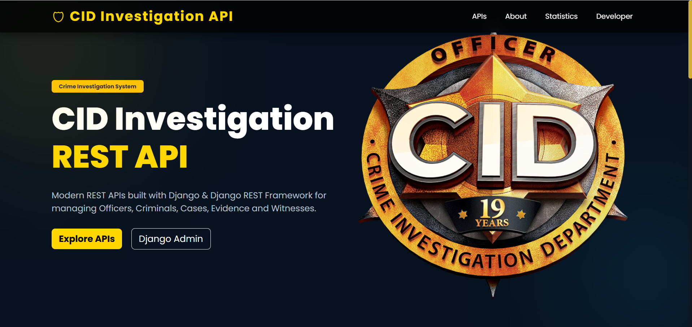
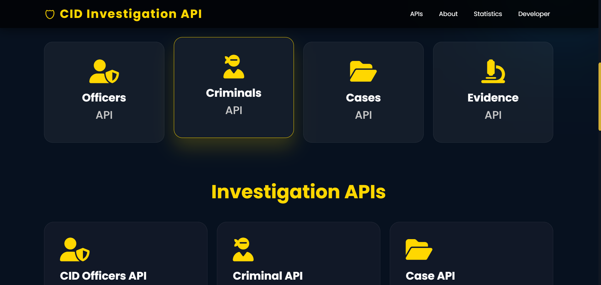
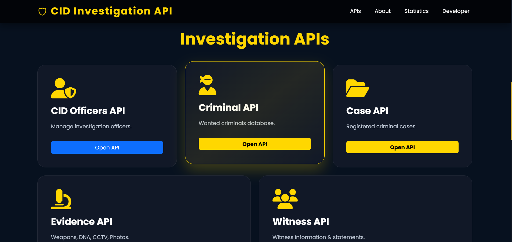
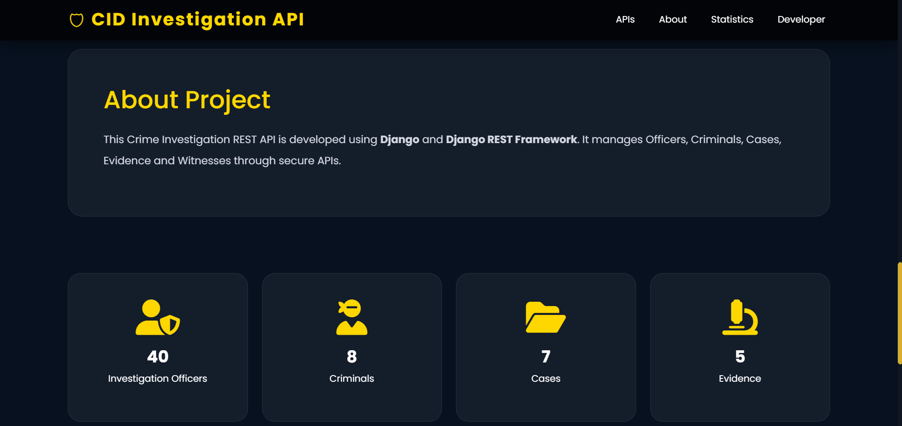
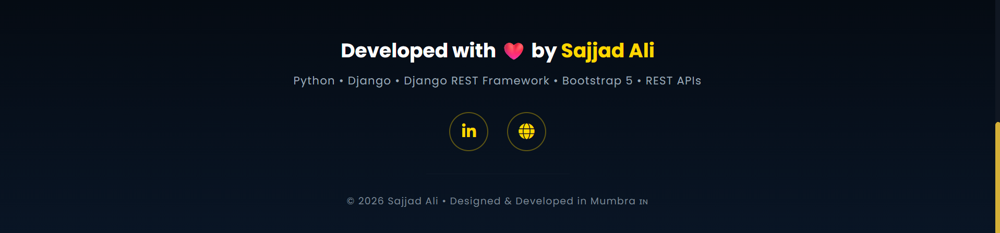

<h1 align="center">🛡️ CID Investigation REST API</h1>

<p align="center">
A Crime Investigation Department (CID) Management System built with Django & Django REST Framework.
</p>

<p align="center">
  
</p>

A **Crime Investigation Department (CID) Management System** built with **Django** and **Django REST Framework (DRF)**. This project provides RESTful APIs to manage Officers, Criminals, Cases, Evidence, and Witnesses — with built-in search, filtering, ordering, and pagination.


---

## 📌 Overview

This system digitizes core CID workflows — officer records, criminal databases, registered cases, collected evidence, and witness statements — and exposes them as clean, filterable REST APIs, along with a Django Admin panel for internal management.

---

## ✨ Features

- 👮 **Officer Management** — Track rank, joining date, and assigned cases
- 🕵️ **Criminal Database** — Store aliases, criminal history, wanted status
- 📁 **Case Registry** — Link officers & criminals to registered cases with status tracking
- 🔬 **Evidence Tracking** — Fingerprint, DNA, CCTV, Weapon, RDX residue, and more
- 🗣️ **Witness Records** — Statements linked to specific cases
- 🔎 **Search, Filter & Ordering** on every API endpoint
- 📄 **Pagination** (page size configurable via settings)
- 🖥️ **Django Admin Panel** with custom list displays & search fields
- 🎨 **Landing Page** built with Bootstrap 5 + Font Awesome showing live stats

---
## 📸 Project Screenshots

<div align="center">

### 🏠 Dashboard


<br><br>

### 🔗 API Endpoints


<br><br>

### 📋 API Documentation


<br><br>

### ℹ️ About Page


<br><br>

### 📄 Footer


</div>
</div>

---

## 🛠️ Tech Stack

| Layer          | Technology                          |
|----------------|--------------------------------------|
| Backend        | Python, Django                      |
| API            | Django REST Framework (DRF)         |
| Database       | SQLite (default, easily swappable)  |
| Frontend       | Bootstrap 5, Font Awesome, HTML/CSS |
| Admin Panel    | Django Admin                        |

---

---

## 🔗 API Endpoints

| Endpoint             | Method | Description                     |
|-----------------------|--------|----------------------------------|
| `/officers-api/`       | GET    | List all officers               |
| `/criminals-api/`      | GET    | List all criminals              |
| `/cases-api/`          | GET    | List all registered cases       |
| `/evidences-api/`      | GET    | List all evidence records       |
| `/witnesses-api/`      | GET    | List all witness statements     |
| `/admin/`              | -      | Django Admin panel              |

### 🔍 Example: Search & Ordering

GET /criminals-api/?search=John&ordering=age
GET /officers-api/?search=Inspector
GET /evidences-api/?search=RDX Explosive Residue

---

## 🧩 DRF Configuration

```python
REST_FRAMEWORK = {
    'DEFAULT_PAGINATION_CLASS': 'rest_framework.pagination.PageNumberPagination',
    'PAGE_SIZE': 3,
    'DEFAULT_FILTER_BACKENDS': (
        'rest_framework.filters.SearchFilter',
        'rest_framework.filters.OrderingFilter',
    )
}
```

---

## 🚀 Future Improvements

- [ ] Add authentication (JWT / Token-based)
- [ ] Add Create/Update/Delete endpoints (currently List-only)
- [ ] Add file upload support for evidence (photos, CCTV footage)
- [ ] Dockerize the project
- [ ] Add unit tests

---

<h2 align="center">👨‍💻 Developer</h2>

<p align="center">

<b>Sajjad Ali</b><br>
Full Stack Python Developer

<br><br>

<a href="https://www.linkedin.com/in/sajjadali-fullstack/">LinkedIn</a> •
<a href="https://sajjadali-fullstack-portfolio.netlify.app/">Portfolio</a>

</p>

---

## 📜 License

This project is licensed under the MIT License — free to use for learning and portfolio purposes.

---

⭐ If you found this project useful, consider giving it a star on GitHub!
